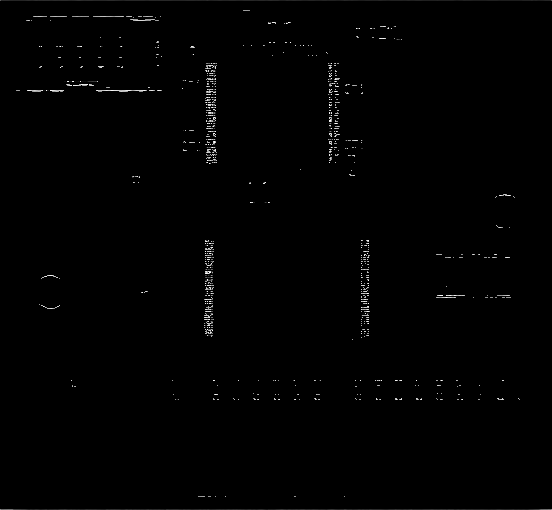
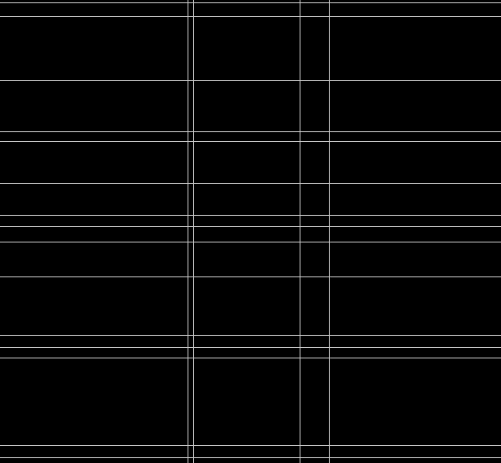
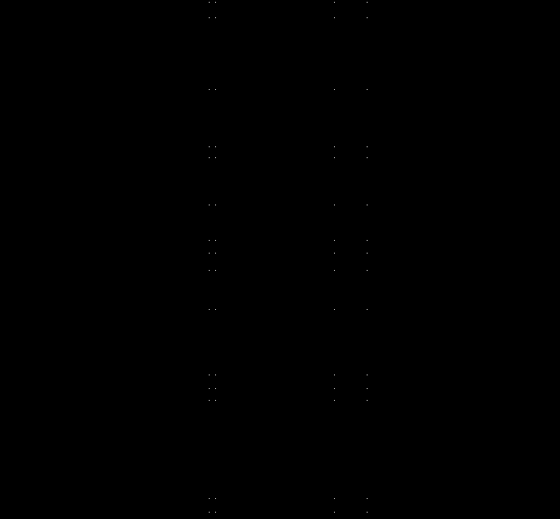
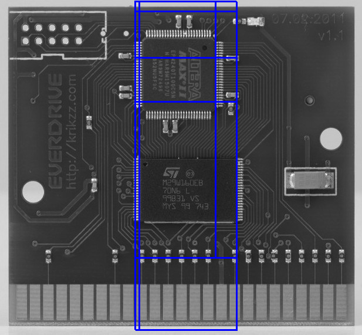

### __Detecting Objects__

To run the application, run make command on part2. 
Then run _./detect \<filename of image\>._

This will create three files:
1. edges.png - Contains the output of the sobel edge detector.
2. detected.png - Contains Input Image with boundaries around the ICs
3. detected.txt - Description of boundaries in the required format.

#### Algorithm:

* The black and white image is take and sibel detector is applied to find the edge points.

* Lines passing through these points are found using Hough Transform.

* The corners on these lines are found using Harris corner detector.

* All the rhombi formed with the corner points are considered.
* The image between the image is clipped and compared in the Fourier space with test images(present in repository) of IC's.
* The boundaries are decided based in the score from the comparison.

#### Assumptions:

* The algorithm assumes that the IC board with be parallel to the edges of the image.
* Only the vertical and horizontal lines are comsidered for corner detection.

#### Test Results:

* The algorithm struggle on IC's with a dimension of less that 32 px is one or more directions.
* Accuracy: The algorithm detects nearly all big square IC's and struggles a little on the rectangualr ones.

#### Future Improvements:

* Non Maximal Suppression of boundaries need to be implemented, edges and lines are implemented.
* More varied sample test images needs to be used for ideal accuracy.

